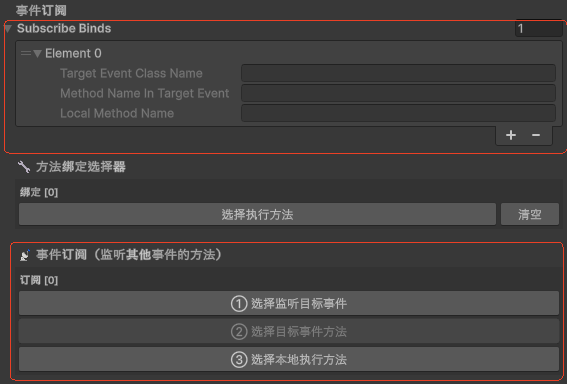

# Unity VContainer 项目

 


## 项目概述

Unity快速开发框架是一个基于 Unity 引擎的模块化应用框架，采用VContainer依赖注入设计模式，实现了松耦合、可扩展的架构。项目集成了事件系统、场景管理、数据同步、标签系统等核心功能，同时预留了与 Web 前端通信的接口。

### 核心特性

- **依赖注入**：基于 VContainer 框架实现的依赖注入系统，支持多种生命周期管理
- **事件系统**：类型安全的事件发布/订阅机制，支持自动取消订阅
- **场景管理**：异步场景加载和状态管理
- **数据同步**：与 Web 端数据交互的能力
- **标签系统**：灵活的标签管理和数据处理
- **输入系统**：集成 Unity 新输入系统
- **Web 桥接**：预留与前端通信的接口
- **资源管理**：集成 Addressable Assets 进行资源管理

## 技术栈

| 技术/框架 | 用途 | 版本 |
|---------|------|------|
| Unity | 游戏引擎 | 6000.3.6+ |
| VContainer | 依赖注入框架 | 1.17.0 |
| C# | 开发语言 | 8.0+ |
| Addressable Assets | 资源管理 | 2.8.1 |
| Input System | 输入处理 | 1.18.0 |
| Universal Render Pipeline | 渲染管线 | 17.3.0 |
| Newtonsoft.Json | JSON 序列化 | 3.2.2 |

## 目录结构

```
Unity_VContainer/
├── Assets/                          # 资产目录
│   ├── AddressableAssetsData/       # Addressable 资源管理
│   ├── Demo/                        # 示例代码
│   │   ├── Event/                   # 事件系统
│   │   │   ├── Core/                # 事件核心
│   │   │   ├── YourEvent1/          # 事件1实现
│   │   │   ├── YourEvent2/          # 事件2实现
│   │   │   └── SceneLoadedEvent.cs  # 场景加载事件
│   │   ├── Extend/                  # 扩展配置
│   │   ├── Interface/               # 接口定义
│   │   ├── LifetimeScope/           # 依赖注入作用域
│   │   ├── Prefab/                  # 预制体
│   │   ├── Public/                  # 公共实现
│   │   └── WebApi/                  # Web API 相关
│   ├── Resources/                   # 资源文件
│   ├── Scenes/                      # 场景
│   ├── Settings/                    # 项目设置
│   └── VContainerSettings.asset     # VContainer 配置
├── Packages/                        # 包管理
├── ProjectSettings/                 # 项目设置
└── README.md                        # 项目文档
```

## 架构设计

### 核心架构

项目采用分层架构设计，主要包含以下层次：

1. **依赖注入层**：负责服务的注册和管理
2. **事件系统层**：处理模块间通信
3. **业务逻辑层**：实现具体业务功能
4. **基础设施层**：提供通用功能和服务

### 设计模式

项目使用了多种设计模式：

- **依赖注入模式**：通过 VContainer 框架实现
- **事件发布/订阅模式**：通过 EventBus 实现
- **工厂模式**：通过 Func<Type, IBaseEvent> 委托实现
- **单例模式**：通过 VContainer 的 Lifetime.Singleton 实现
- **观察者模式**：通过 EventBus 的订阅机制实现
- **桥接模式**：通过 WebMsgHandlerManager 实现
- **策略模式**：通过 IEventMsgHandler 接口实现
- **模板方法模式**：通过 BaseEvent 基类实现

### 核心模块

#### 1. 依赖注入模块

**核心组件**：
- `RootLifetimeScope`：根作用域，负责注册全局服务
- `Scene1_LifetimeScope`：场景级作用域，负责注册场景特定服务

**功能**：
- 服务注册和管理
- 生命周期管理（单例、作用域、瞬态）
- 依赖解析
- 自动注册事件类型和处理器

#### 2. 事件系统模块

**核心组件**：
- `EventBus`：事件总线，负责事件的发布和订阅
- `EventStack`：事件栈，管理事件的层级关系
- `BaseEvent`：事件基类
- 具体事件实现（如 `YourEvent1`、`YourEvent2`）
- 事件处理器（如 `YourEvent1MsgHandler`）

**功能**：
- 事件发布和订阅
- 事件类型管理
- 事件栈管理
- 自动取消订阅

#### 3. 场景管理模块

**核心组件**：
- `SceneLoadManager`：场景加载管理器

**功能**：
- 异步场景加载
- 加载完成通知
- 与 Web 前端通信

#### 5. 标签系统模块

**核心组件**：
- `LabelManager`：标签管理器
- `YourEvent1LabelController`：标签控制器
- `LabelItem`、`LabelNewItem`：标签项

**功能**：
- 标签管理
- 标签数据处理
- 标签状态同步

#### 7. Web 桥接模块

**核心组件**：
- `WebMsgHandlerManager`：Web 消息处理器管理器

**功能**：
- 管理 Web 消息处理器
- 与前端通信的桥接
- 消息的分发和处理

#### 8. 资源管理模块

**核心组件**：
- Unity Addressable Assets 配置

**功能**：
- 资源打包
- 内容更新
- 资源组管理


## 快速开始

### 安装

1. **克隆仓库**：
   ```bash
   联系项目负责人获得git地址
   ```

2. **打开项目**：
   - 使用 Unity 6000.3.6f1 或更高版本打开项目

3. **安装依赖**：
   - 依赖项已在 `Packages/manifest.json` 中配置，Unity 会自动安装

### 使用

1. **配置 VContainer**：
   - 在 `VContainerSettings.asset` 中设置根作用域预制体

2. **注册服务**：
   - 在 `RootLifetimeScope.cs` 中注册全局服务
   - 在 `Scene1_LifetimeScope.cs` 中注册场景特定服务

3. **创建事件**：
   - 继承 `BaseEvent` 类创建新事件
   - 实现 `IEventMsgHandler` 接口创建事件处理器

4. **使用事件**：
   - 通过 `IEventBus` 发布和订阅事件

5. **加载场景**：
   - 使用 `ISceneLoadManager` 异步加载场景

## 代码示例

### 注册服务

```csharp
using jp.hadashikick.vcontainer;
using jp.hadashikick.vcontainer.unity;

public class RootLifetimeScope : LifetimeScope
{
    protected override void Configure(IContainerBuilder builder)
    {
        // 注册事件总线
        builder.Register<IEventBus, EventBus>(Lifetime.Singleton);
        // 注册工具类
        builder.Register<JsonSerializer>(Lifetime.Singleton);
        // 注册全局管理器
        builder.Register<ISceneLoadManager, SceneLoadManager>(Lifetime.Singleton);
        builder.Register<IDataSyncManager, DataSyncManager>(Lifetime.Singleton);
        builder.Register<ILabelManager, LabelManager>(Lifetime.Singleton);
        // 注册入口点
        builder.RegisterEntryPoint<RootEntryPoint>();
    }
}
```

### 发布事件

```csharp
public class SomeService
{
    private readonly IEventBus _eventBus;

    public SomeService(IEventBus eventBus)
    {
        _eventBus = eventBus;
    }

    public void DoSomething()
    {
        // 发布事件
        _eventBus.Publish(new YourEvent1 { Message = "Hello World" });
    }
}
```
### 订阅事件

<div align="center">
  
  <p style="color: #999; font-size: 14px;">图：事件配置页面截图</p>
</div>

## 配置

### VContainer 配置

**配置文件**：`VContainerSettings.asset`

**主要设置**：
- RootLifetimeScope：根作用域预制体
- EnableDiagnostics：诊断功能（默认禁用）
- DisableScriptModifier：脚本修改器（默认禁用）
- RemoveClonePostfix：移除克隆后缀（默认禁用）

### 事件配置

**配置文件**：`Resources/EventConfigs/` 目录下的 `EventConfig_*.asset` 文件


## 许可证

本项目采用 MIT 许可证 - 详见 [LICENSE](LICENSE) 文件

---

*Made with RenHao for Unity development*